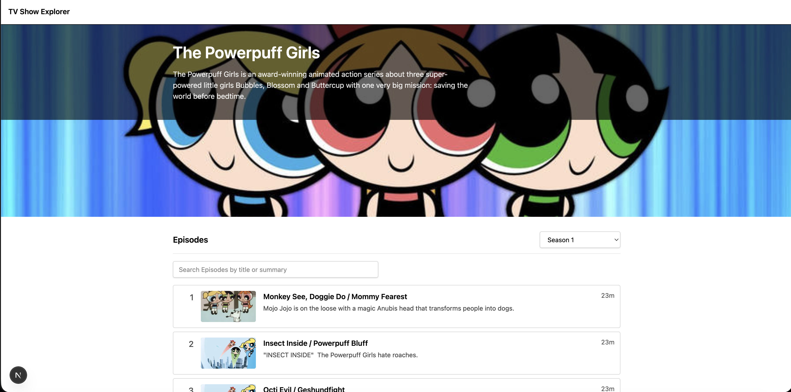

# TV Show Explorer - The Powerpuff Girls

A small `Next.js` + `TypeScript` application that allows the user to explore the Powerpuff girls TV show and it's episodes.



## Getting Started

### Install dependencies

```bash

npm install

npm run dev

```

Open http://localhost:3000 in your browser.


## Architecture Decisions

Tech used: `Next.js`, `TypeScript`, `React 18+`, `Tailwind CSS`, `Vitest` + `React Testing Library`, TVMaze API

### Server vs Client Components

Pages are built as `Server Components` for data fetching and rendering with `Client component` used only where interactivity is needed.

### Data Fetching

All TVMaze API calls are centralized in a `lib/` layer and use time-based revalidation to balance performance and freshnes.

### Error Handling

Explicit route-level `error.tsx`, `loading.tsx` and `not-found.tsx` files to handle error handling and loading states.

### Accessibility

The UI relies on native `HTML` elements and clear labels to ensure accessibility.

## Key Trade-offs

### Client-side filtering for episode search

Search filters the already loaded episodes in memory, which makes typing instantly responsive with results. The trade off is that it only works on the currently loaded season and scaling is limited if the there are hunders/thousands of episodes.

### Static banner image and a placeholder episode image

Used a static banner image instead of TVMaze image because the API image wasn't suitable for a hero layout. Also as the API didn't always returned valid episode images, a placeholder image was placed for it.

### Minimal client-side state

The app keeps client state limited to season selection, search input and error flags to make things simple. There is no global state management or caching across navigations. In a production-like environment, would be better to use TanStack Query to avoid refetching when switching between seasons.

## What I Would Improve With More Time

### Allow users to favorite episodes and implement pagination on results

To let users mark episodes as favorites with a simple store (like a JSON file or SQLite). On the UI, add a favorite button, a filter for favorites. Also implement pagination.

### Add i18n support

Move all UI text into translation files so it’s easy to add languages later.

### Enhance error recovery and reasearch more on API error codes and handling

Make errors easier and user friendly with correct user response to follow based on each error with retry button or back button. Also review TVMaze API behavior in practice and ensure code treats each response appropriately and better diagnostics in development.

### Add more unit tests